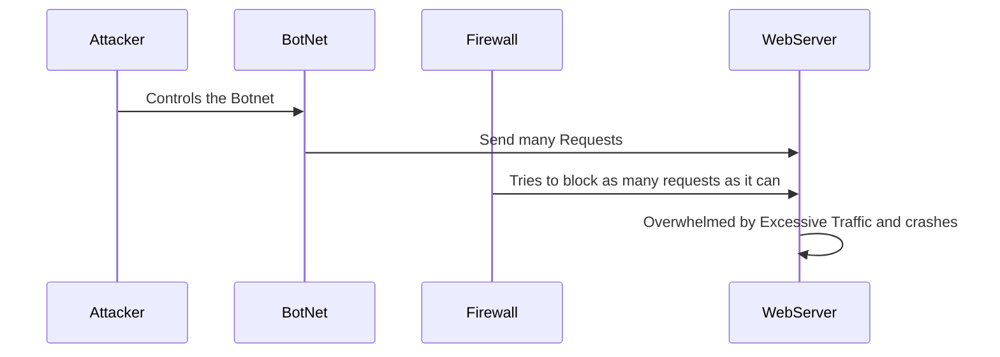

The Attacker wants to bring down the WebServer so they send out many requests through a BotNet. The Firewall does what it can to minimize the amount of requests but the WebServer is ultimately overwhelmed and crashes.
